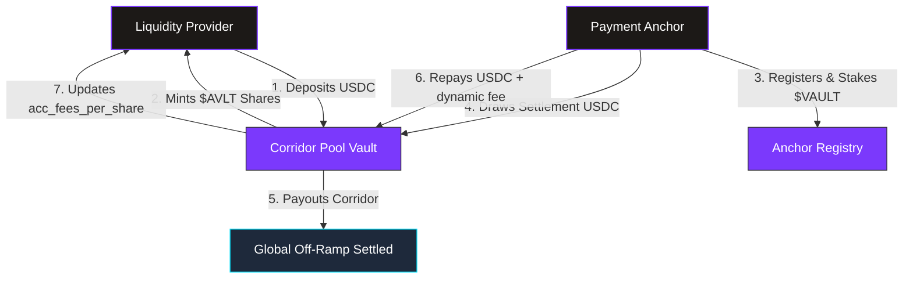
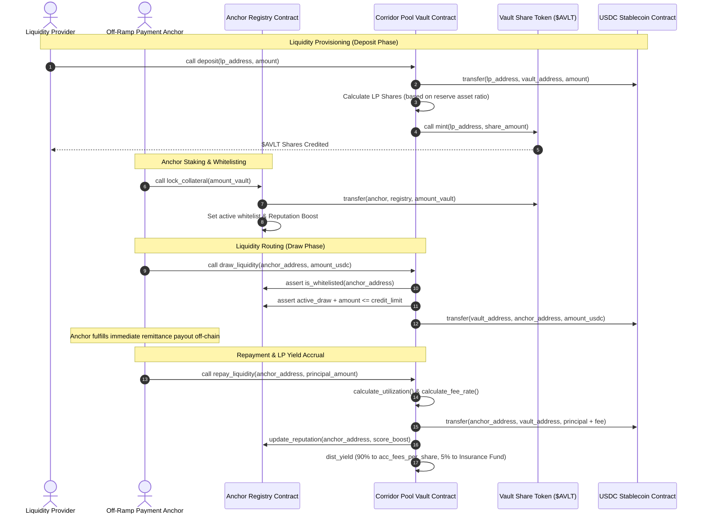

# AnchorVault

### Trustless On-Chain Remittance Liquidity Routing

[](https://casper.network) [](https://docs.casper.network) [](#deployed-smart-contract-addresses-casper-condor-testnet) [](LICENSE)

[](https://www.anchorvault.xyz) [](https://x.com/shriyashsoni_) [](https://github.com/shriyashsoni) [](#documentation)

**AnchorVault** is a production-grade, decentralized liquidity protocol built on the **Casper Network (Rust/WASM)**. It bridges Liquidity Providers (LPs) with authorized off-ramp payment anchors to facilitate instant, cross-border remittances. LPs lock stablecoin reserves into corridor pools and organic yield is dynamically routed to them from real payment settlement flows.

[Explore the App](https://www.anchorvault.xyz) · [Read the Docs](#documentation) · [View on CSPR.live](#deployed-smart-contract-addresses-casper-condor-testnet) · [Report a Bug](https://github.com/shriyashsoni/anchorvault-casper/issues/new)

---

## Table of Contents

- [Deployed Smart Contract Addresses (Casper Condor Testnet)](#deployed-smart-contract-addresses-casper-condor-testnet)
- [Protocol Architecture & Flow Charts](#protocol-architecture--flow-charts)
- [Core Working Functionality](#core-working-functionality)
- [Dynamic Interest & Fee Model](#dynamic-interest--fee-model)
- [Tech Stack](#tech-stack)
- [Developer Setup & Deployment Guide](#developer-setup--deployment-guide)
- [SDK Integration](#sdk-integration)
- [Documentation](#documentation)
- [Contributing](#contributing)
- [Credits & Contact](#credits--contact)
- [License](#license)

---

## Deployed Smart Contract Addresses (Casper Condor Testnet)

> **All contracts are live and verified on the Casper Condor Testnet.**
> Click on any contract address to view it on [CSPR.live](https://testnet.cspr.live).

| Contract Component | Casper Contract Hash | Explorer Link |
| :--- | :--- | :---: |
| **Casper USDC Stablecoin (Mock)** | `hash-103fcc98fd1eb7fcd3c204683d4ff438665dcd33b486564cd46cc90d6db7344f` | [View](https://testnet.cspr.live/contract/hash-103fcc98fd1eb7fcd3c204683d4ff438665dcd33b486564cd46cc90d6db7344f) |
| **Vault Share Token ($AVLT)** | `hash-25b57f2e9e9786f0abeb990c4329338d8292f7ef9d571fb35f8db5f650b8d6c5` | [View](https://testnet.cspr.live/contract/hash-25b57f2e9e9786f0abeb990c4329338d8292f7ef9d571fb35f8db5f650b8d6c5) |
| **Anchor Registry** | `hash-f6194b438a39fdd09fff2c3c6d91a696a7a028758cccd220b2026753b5d67e7a` | [View](https://testnet.cspr.live/contract/hash-f6194b438a39fdd09fff2c3c6d91a696a7a028758cccd220b2026753b5d67e7a) |
| **Corridor Pool Core Vault** | `hash-1289a75c7b0891ba4d3e2d60ec3b2234db8541fc8ee67997934044ef61e2139c` | [View](https://testnet.cspr.live/contract/hash-1289a75c7b0891ba4d3e2d60ec3b2234db8541fc8ee67997934044ef61e2139c) |

---

## Protocol Architecture & Flow Charts

AnchorVault coordinates three distinct entities trustlessly on-chain: **Liquidity Providers**, **Payment Anchors**, and the **Core Smart Contracts**.

### 1. High-Level Protocol Architecture


### 2. Detailed LP & Anchor Operational Lifecycle


---

## Core Working Functionality

### 1. Corridor Pool Vault (`anchor_vault`)
LPs deposit USDC stablecoin to earn interest from global cross-border remittances. When USDC is deposited, LPs are minted **$AVLT** share tokens.
* **LP Deposits & Withdrawals**: LP deposit shares are calculated relative to the entire pool valuation (Cash Reserves + Outstanding Anchor Draws). If the pool is highly utilized, withdrawals are queued or restricted to protect liquidity.
* **Yield Accrual Mechanism**: As anchors repay their draws plus interest, **90% of the settlement fee** is added to `acc_fees_per_share` (scaled by $10^{12}$ for precise fraction arithmetic). The next time an LP interacts with the pool (e.g. deposits or withdraws), their accumulated share of yield is automatically disbursed.

### 2. Anchor Registry (`anchor_registry`)
Before drawing capital to settle a payment, anchors must undergo reputational whitelisting.
* **Collateral Lockups**: Anchors lock up governance $VAULT tokens into the registry to back their credit capacity. 
* **Dynamic Credit Limit**: The system enforces a **10% minimum collateral-to-credit ratio** (1000 bps). An anchor's reputation score determines how close to this ratio they can draw.
* **Reputation Tracking**: Successful, timely repayments boost the score (up to 1000). Defaults, delayed payments, or protocol alerts trigger a score slash, automatically restricting their credit capacity.

---

## Dynamic Interest & Fee Model

The vault manages LP risk and incentivizes anchor repayments by computing fees using a **Two-Slope Utilization Curve**.

### 1. Pool Utilization ($U$)
The pool utilization is the ratio of active anchor draws to total capital:
$$U = \frac{\text{active\_draws}}{\text{reserve\_balance} + \text{active\_draws}}$$

### 2. Fee Rate Calculation ($R$)
The fee rate $R$ (in basis points) changes dynamically based on whether utilization exceeds the optimal threshold ($U_{\text{optimal}}$):

* **If $U \le U_{\text{optimal}}$ (Normal Range)**:
  Interest fees scale moderately to keep capital borrow costs low:
  $$R = R_{\text{base}} + \left(\frac{U}{U_{\text{optimal}}}\right) \times R_{\text{slope1}}$$

* **If $U > U_{\text{optimal}}$ (High Risk / Penalty Range)**:
  Interest fees scale aggressively to discourage further draws and force anchors to repay, restoring liquidity:
  $$R = R_{\text{base}} + R_{\text{slope1}} + \left(\frac{U - U_{\text{optimal}}}{10000 - U_{\text{optimal}}}\right) \times R_{\text{slope2}}$$

#### Deployed Parameters:
| Parameter | Value | Basis Points |
| :--- | :--- | :--- |
| Optimal Utilization ($U_{\text{optimal}}$) | **80.00%** | 8000 bps |
| Base Fee Rate ($R_{\text{base}}$) | **1.00%** | 100 bps |
| Slope 1 Rate ($R_{\text{slope1}}$) | **4.00%** | 400 bps |
| Slope 2 Penalty Rate ($R_{\text{slope2}}$) | **50.00%** | 5000 bps |

---

## Tech Stack

| Layer | Technology | Purpose |
| :--- | :--- | :--- |
| **Blockchain** | [Casper Network](https://casper.network) | Layer-1 network for fast, secure enterprise transactions |
| **Smart Contracts** | Rust (WASM) | On-chain logic for vault, registry, and token contracts |
| **Frontend** | React + TypeScript + Vite | High-fidelity liquid-glass themed DeFi dashboard |
| **Wallet** | [Casper Wallet](https://www.casperwallet.io/) | Native browser wallet extension for signing transactions |
| **Token Standard** | CEP-18 | Standard for fungible tokens on Casper |
| **RPC** | HTTP JSON-RPC | Direct node interaction for querying state and balances |
| **Explorer** | [CSPR.live](https://testnet.cspr.live) | On-chain verification and transaction tracking |
| **Styling** | Vanilla CSS + Glassmorphism | Premium dark-mode UI with dynamic animations |

---

## Developer Setup & Deployment Guide

Follow these steps to deploy and run AnchorVault locally or on the Casper Condor Testnet.

### 1. Prerequisites
Ensure you have the following installed on your developer machine:
* [Rust & Cargo](https://www.rust-lang.org/tools/install) — Smart contract compilation
* Target support: `rustup target add wasm32-unknown-unknown`
* [Node.js (v18+)](https://nodejs.org/) — Frontend and deployment scripts
* [Casper Client](https://docs.casper.network/developers/cli/) (Optional) — CLI tools

### 2. Installation
```bash
git clone https://github.com/shriyashsoni/anchorvault-casper.git
cd "anchorvault onchain casper"
npm install
```

### 3. Configure Environment
Create a `.env` file with your Casper Testnet credentials (or rely on existing setup scripts):
```env
CASPER_NETWORK=casper-test
CASPER_RPC_URL=https://node.testnet.casper.network/rpc
```
Run the key generation script if you do not have testnet keys:
```bash
npm run setup-keys
```
*(This generates `public_key.pem` and `secret_key.pem` locally.)*

### 4. Deploy Smart Contracts
Upload WASM bytecode and instantiate all protocol contracts on-chain to the Casper Testnet:
```bash
node deploy_final.cjs
```

### 5. Launch Frontend
```bash
npm run dev
```
Open **`http://localhost:5173/`** to interact with the live DeFi portal. Ensure your Casper Wallet is connected to the Testnet.

---

## SDK Integration

Integrate AnchorVault into your own applications using the Casper JS SDK.

### Install Dependencies
```bash
npm install casper-js-sdk
```

### Quick Start
```typescript
import casper from 'casper-js-sdk';
const { DeployUtil, CLPublicKey, RuntimeArgs } = casper;

// Connect to Casper Testnet RPC
const CASPER_RPC_URL = 'https://node.testnet.casper.network/rpc';
const NETWORK_NAME = 'casper-test';

// Available Contract Hashes
const CONTRACT_ADDRESSES = {
  USDC:             "hash-103fcc98fd1eb7fcd3c204683d4ff438665dcd33b486564cd46cc90d6db7344f",
  GOVERNANCE_TOKEN: "hash-25b57f2e9e9786f0abeb990c4329338d8292f7ef9d571fb35f8db5f650b8d6c5",
  ANCHOR_REGISTRY:  "hash-f6194b438a39fdd09fff2c3c6d91a696a7a028758cccd220b2026753b5d67e7a",
  CORE_VAULT:       "hash-1289a75c7b0891ba4d3e2d60ec3b2234db8541fc8ee67997934044ef61e2139c",
};
```

### Wallet Integration (Casper Wallet)
```typescript
async function connectWallet() {
  if (window.CasperWallet) {
    const isConnected = await window.CasperWallet.isConnected();
    if (!isConnected) {
      await window.CasperWallet.requestConnection();
    }
    const activeKey = await window.CasperWallet.getActivePublicKey();
    return activeKey;
  }
  throw new Error("Casper Wallet extension not found");
}

async function signWithCasperWallet(deployJson, publicKey) {
  return await window.CasperWallet.sign(deployJson, publicKey);
}
```

For the complete TypeScript integration including deposit, withdraw, draw liquidity, and repayment flows via the Casper RPC, see [`src/lib/casper.ts`](src/lib/casper.ts).

---

## Contributing

Contributions are welcome! Whether it's a bug fix, feature request, or documentation improvement, we appreciate your help.

### How to Contribute

1. **Fork** the repository
2. **Create** a feature branch
   ```bash
   git checkout -b feature/your-feature-name
   ```
3. **Commit** your changes with clear messages
   ```bash
   git commit -m "feat: add your feature description"
   ```
4. **Push** to your fork
   ```bash
   git push origin feature/your-feature-name
   ```
5. **Open a Pull Request** against the `main` branch

### Code Style
* Rust contracts follow standard `rustfmt` formatting
* TypeScript/React follows ESLint with Prettier
* Commit messages follow [Conventional Commits](https://www.conventionalcommits.org/)

---

## Credits & Contact

**Built with passion by [Shriyash Soni](https://github.com/shriyashsoni)**

[](https://www.anchorvault.xyz) [](https://x.com/shriyashsoni_) [](https://github.com/shriyashsoni) [](https://x.com/Anchor_Vault)

### Acknowledgements
* [Casper Association](https://casper.network) — Layer-1 blockchain infrastructure
* [Casper Wallet](https://www.casperwallet.io/) — Browser wallet extension

---

## License

This project is licensed under the **MIT License**. See [LICENSE](LICENSE) for details.

**[www.anchorvault.xyz](https://www.anchorvault.xyz)**

<sub>AnchorVault — Powering the future of decentralized cross-border remittances on Casper.</sub>
