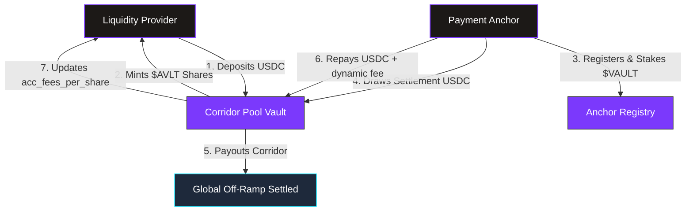
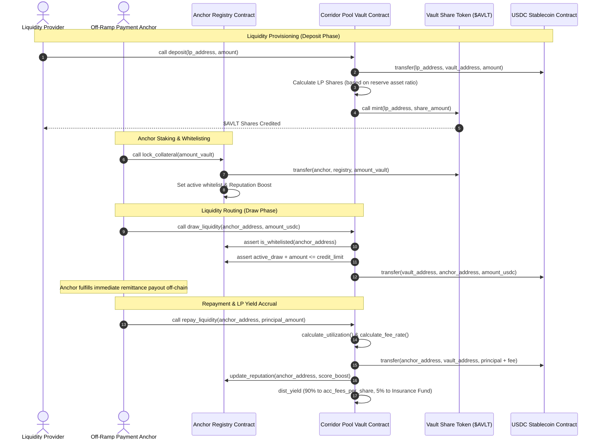

# AnchorVault

### Trustless On-Chain Remittance Liquidity Routing

[](https://casper.network) [](https://docs.casper.network) [](#deployed-smart-contract-addresses-casper-testnet) [](LICENSE)

[](https://www.anchorvault.xyz) [](https://x.com/shriyashsoni_) [](https://github.com/shriyashsoni) [](#documentation)

**AnchorVault** is a production-grade, decentralized liquidity protocol built on the **Casper Network**. It bridges Liquidity Providers (LPs) with authorized off-ramp payment anchors to facilitate instant, cross-border remittances. LPs lock stablecoin reserves into corridor pools and organic yield is dynamically routed to them from real payment settlement flows.

[Explore the App](https://www.anchorvault.xyz) · [Read the Docs](#documentation) · [View on CSPR.live](#deployed-smart-contract-addresses-casper-testnet) · [Report a Bug](https://github.com/shriyashsoni/anchorvault/issues/new)

---

## Table of Contents

- [Deployed Smart Contract Addresses (Casper Mainnet)](#deployed-smart-contract-addresses-Casper-mainnet)
- [Protocol Architecture & Flow Charts](#protocol-architecture--flow-charts)
- [Core Working Functionality](#core-working-functionality)
- [Dynamic Interest & Fee Model](#dynamic-interest--fee-model)
- [Tech Stack](#tech-stack)
- [Developer Setup & Deployment Guide](#developer-setup--deployment-guide)
- [SDK Integration](#sdk-integration)
- [Documentation](#documentation)
- [Contributing](#contributing)
- [Credits & Contact](#credits--contact)
- [License](#license)

---

## Deployed Smart Contract Addresses (Casper Mainnet)

> **All contracts are live and verified on the Casper Mainnet.**
> Click on any contract address to view it on [Casper Expert](https://Casper.expert).

| Contract Component | Casper Contract Address | Explorer Link |
| :--- | :--- | :---: |
| **Casper USDC Stablecoin** | `CCW67TSZV3SSS2HXMBQ5JFGCKJNXKZM7UQUWUZPUTHXSTZLEO7SJMI75` | [View](https://Casper.expert/explorer/public/contract/CCW67TSZV3SSS2HXMBQ5JFGCKJNXKZM7UQUWUZPUTHXSTZLEO7SJMI75) |
| **Vault Share Token ($AVLT)** | `CDXELK3CF4GHCK6U3NETR2NNONDV3VDNKM7MT4QD5M23AHRN5X47O4IF` | [View](https://Casper.expert/explorer/public/contract/CDXELK3CF4GHCK6U3NETR2NNONDV3VDNKM7MT4QD5M23AHRN5X47O4IF) |
| **Anchor Registry** | `CA6NMU2ADEKVTS4XBZRLAARH7VSF7JEKWKAHNVT7WE5ZIEEKKOCOM6QO` | [View](https://Casper.expert/explorer/public/contract/CA6NMU2ADEKVTS4XBZRLAARH7VSF7JEKWKAHNVT7WE5ZIEEKKOCOM6QO) |
| **Corridor Pool Core Vault** | `CDO3GSX27G6TAHLBROCC6WV4TNM6BWLFZDT2OW6RSUVBSGZJKTIISJFG` | [View](https://Casper.expert/explorer/public/contract/CDO3GSX27G6TAHLBROCC6WV4TNM6BWLFZDT2OW6RSUVBSGZJKTIISJFG) |

---

## Protocol Architecture & Flow Charts

AnchorVault coordinates three distinct entities trustlessly on-chain: **Liquidity Providers**, **Payment Anchors**, and the **Core Smart Contracts**.

### 1. High-Level Protocol Architecture


### 2. Detailed LP & Anchor Operational Lifecycle


---

## Core Working Functionality

### 1. Corridor Pool Vault (`anchor_vault`)
LPs deposit USDC stablecoin to earn interest from global cross-border remittances. When USDC is deposited, LPs are minted **$AVLT** share tokens.
* **LP Deposits & Withdrawals**: LP deposit shares are calculated relative to the entire pool valuation (Cash Reserves + Outstanding Anchor Draws). If the pool is highly utilized, withdrawals are queued or restricted to protect liquidity.
* **Yield Accrual Mechanism**: As anchors repay their draws plus interest, **90% of the settlement fee** is added to `acc_fees_per_share` (scaled by $10^{12}$ for precise fraction arithmetic). The next time an LP interacts with the pool (e.g. deposits or withdraws), their accumulated share of yield is automatically disbursed.

### 2. Anchor Registry (`anchor_registry`)
Before drawing capital to settle a payment, anchors must undergo reputational whitelisting.
* **Collateral Lockups**: Anchors lock up governance $VAULT tokens into the registry to back their credit capacity. 
* **Dynamic Credit Limit**: The system enforces a **10% minimum collateral-to-credit ratio** (1000 bps). An anchor's reputation score determines how close to this ratio they can draw.
* **Reputation Tracking**: Successful, timely repayments boost the score (up to 1000). Defaults, delayed payments, or protocol alerts trigger a score slash, automatically restricting their credit capacity.

---

## Dynamic Interest & Fee Model

The vault manages LP risk and incentivizes anchor repayments by computing fees using a **Two-Slope Utilization Curve**.

### 1. Pool Utilization ($U$)
The pool utilization is the ratio of active anchor draws to total capital:
$$U = \frac{\text{active\_draws}}{\text{reserve\_balance} + \text{active\_draws}}$$

### 2. Fee Rate Calculation ($R$)
The fee rate $R$ (in basis points) changes dynamically based on whether utilization exceeds the optimal threshold ($U_{\text{optimal}}$):

* **If $U \le U_{\text{optimal}}$ (Normal Range)**:
  Interest fees scale moderately to keep capital borrow costs low:
  $$R = R_{\text{base}} + \left(\frac{U}{U_{\text{optimal}}}\right) \times R_{\text{slope1}}$$

* **If $U > U_{\text{optimal}}$ (High Risk / Penalty Range)**:
  Interest fees scale aggressively to discourage further draws and force anchors to repay, restoring liquidity:
  $$R = R_{\text{base}} + R_{\text{slope1}} + \left(\frac{U - U_{\text{optimal}}}{10000 - U_{\text{optimal}}}\right) \times R_{\text{slope2}}$$

#### Deployed Parameters:
| Parameter | Value | Basis Points |
| :--- | :--- | :--- |
| Optimal Utilization ($U_{\text{optimal}}$) | **80.00%** | 8000 bps |
| Base Fee Rate ($R_{\text{base}}$) | **1.00%** | 100 bps |
| Slope 1 Rate ($R_{\text{slope1}}$) | **4.00%** | 400 bps |
| Slope 2 Penalty Rate ($R_{\text{slope2}}$) | **50.00%** | 5000 bps |

---

## Tech Stack

| Layer | Technology | Purpose |
| :--- | :--- | :--- |
| **Blockchain** | [Casper](https://Casper.org) | Layer-1 network for fast, low-cost transactions |
| **Smart Contracts** | [Casper WASM](https://Casper WASM.Casper.org) (Rust / WASM) | On-chain logic for vault, registry, and token contracts |
| **Frontend** | React + TypeScript + Vite | High-fidelity liquid-glass themed DeFi dashboard |
| **Wallet** | [Casper Wallet](https://Casper Wallet.app) | Casper browser wallet extension for signing transactions |
| **Stablecoin** | [USDC](https://www.circle.com/en/usdc) (Circle) | Official Casper Asset Contract for corridor pool reserves |
| **RPC** | [Casper WASM RPC](https://mainnet.Casper WASMrpc.com) | Mainnet JSON-RPC endpoint for contract interaction |
| **Explorer** | [Casper Expert](https://Casper.expert) | On-chain verification and transaction tracking |
| **Styling** | Vanilla CSS + Glassmorphism | Premium dark-mode UI with dynamic animations |

---

## Developer Setup & Deployment Guide

Follow these steps to deploy and run AnchorVault locally or on the Casper Mainnet.

### 1. Prerequisites
Ensure you have the following installed on your developer machine:
* [Rust & Cargo](https://www.rust-lang.org/tools/install) — Smart contract compilation
* Target support: `rustup target add wasm32-unknown-unknown`
* [Casper WASM CLI](https://developers.Casper.org/docs/smart-contracts/getting-started/setup) — Contract deployment tooling
* [Node.js (v18+)](https://nodejs.org/) — Frontend and deployment scripts

### 2. Installation
```bash
git clone https://github.com/shriyashsoni/anchorvault.git
cd anchorvault
npm install
```

### 3. Configure Environment
Create a `.env` file with your Casper Mainnet credentials:
```env
Casper_NETWORK=mainnet
Casper WASM_RPC_URL=https://mainnet.Casper WASMrpc.com
Casper_NETWORK_PASSPHRASE="Public Global Casper Network ; September 2015"
DEPLOYER_SECRET_KEY="S..."
DEPLOYER_PUBLIC_KEY="G..."
```

### 4. Deploy Smart Contracts
Upload WASM bytecode and instantiate all protocol contracts on-chain:
```bash
npm run deploy
```

### 5. Initialize Protocol
Configure token authorities, register anchors, and set fee curve parameters:
```bash
npm run initialize
```

### 6. Launch Frontend
```bash
npm run dev
```
Open **`http://localhost:5173/`** to interact with the live DeFi portal.

---

## SDK Integration

Integrate AnchorVault into your own applications using the Casper SDK and our TypeScript bindings.

### Install Dependencies
```bash
npm install @Casper/Casper-sdk @Casper/Casper Wallet-api
```

### Quick Start
```typescript
import { rpc, Contract, TransactionBuilder } from '@Casper/Casper-sdk';
import { CONTRACT_ADDRESSES } from './src/lib/Casper WASM';

// Connect to Casper Mainnet RPC
const server = new rpc.Server('https://mainnet.Casper WASMrpc.com');
const networkPassphrase = 'Public Global Casper Network ; September 2015';

// Reference any deployed contract
const vaultContract = new Contract(CONTRACT_ADDRESSES.CORE_VAULT);
const registryContract = new Contract(CONTRACT_ADDRESSES.ANCHOR_REGISTRY);
const tokenContract = new Contract(CONTRACT_ADDRESSES.GOVERNANCE_TOKEN);
```

### Available Contract Addresses
```typescript
const CONTRACT_ADDRESSES = {
  USDC:             "CCW67TSZV3SSS2HXMBQ5JFGCKJNXKZM7UQUWUZPUTHXSTZLEO7SJMI75",
  GOVERNANCE_TOKEN: "CDXELK3CF4GHCK6U3NETR2NNONDV3VDNKM7MT4QD5M23AHRN5X47O4IF",
  ANCHOR_REGISTRY:  "CA6NMU2ADEKVTS4XBZRLAARH7VSF7JEKWKAHNVT7WE5ZIEEKKOCOM6QO",
  CORE_VAULT:       "CDO3GSX27G6TAHLBROCC6WV4TNM6BWLFZDT2OW6RSUVBSGZJKTIISJFG",
};
```

### Wallet Integration (Casper Wallet)
```typescript
import { isConnected, signTransaction } from '@Casper/Casper Wallet-api';

async function signWithCasper Wallet(txXdr: string) {
  if (await isConnected()) {
    const signedXdr = await signTransaction(txXdr, {
      network: 'MAINNET',
      networkPassphrase: 'Public Global Casper Network ; September 2015'
    });
    return signedXdr;
  }
  throw new Error('Casper Wallet Wallet extension not detected.');
}
```

For the complete TypeScript integration including deposit, withdraw, draw liquidity, and repayment flows, see [`src/lib/Casper WASM.ts`](src/lib/Casper WASM.ts).

---

## Documentation

Full protocol documentation is available in the [`docs/`](docs/) directory and on the [AnchorVault Docs Portal](https://www.anchorvault.xyz/docs).

### Getting Started
| Document | Description |
| :--- | :--- |
| [Introduction](docs/introduction.mdx) | Protocol overview and vision |
| [Quickstart Guide](docs/quickstart.mdx) | Get up and running in 10 minutes |
| [Architecture](docs/architecture.mdx) | System design and contract interactions |

### Core Concepts
| Document | Description |
| :--- | :--- |
| [Liquidity Providers](docs/concepts/liquidity-providers.mdx) | How LPs earn yield from remittance flows |
| [Payment Anchors](docs/concepts/payment-anchors.mdx) | Anchor whitelisting and settlement mechanics |
| [Corridor Pools](docs/concepts/corridor-pools.mdx) | Multi-corridor liquidity routing architecture |
| [Yield Model](docs/concepts/yield-model.mdx) | Two-slope utilization curve and fee distribution |
| [Reputation System](docs/concepts/reputation-system.mdx) | On-chain anchor reputation scoring |
| [Insurance Fund](docs/concepts/insurance-fund.mdx) | Protocol reserve for default protection |

### Smart Contract Reference
| Document | Description |
| :--- | :--- |
| [Contracts Overview](docs/contracts/overview.mdx) | Summary of all deployed Casper WASM contracts |
| [Corridor Vault](docs/contracts/corridor-vault.mdx) | Core vault deposit/withdraw/draw/repay logic |
| [Anchor Registry](docs/contracts/anchor-registry.mdx) | Whitelisting, collateral, and credit limits |
| [Vault Token](docs/contracts/vault-token.mdx) | $AVLT share token mint/burn mechanics |

### SDK & Integration
| Document | Description |
| :--- | :--- |
| [TypeScript SDK](docs/sdk/typescript-sdk.mdx) | Full SDK reference and setup guide |
| [Transaction Building](docs/sdk/transaction-building.mdx) | How to build and submit Casper WASM transactions |
| [Wallet Integration](docs/sdk/wallet-integration.mdx) | Casper Wallet wallet connection and signing |
| [Querying State](docs/sdk/querying-state.mdx) | Reading on-chain contract state |

### Deployment
| Document | Description |
| :--- | :--- |
| [Prerequisites](docs/deployment/prerequisites.mdx) | Required tools and environment setup |
| [Compile Contracts](docs/deployment/compile-contracts.mdx) | Building optimized WASM binaries |
| [Deploy to Mainnet](docs/deployment/deploy-testnet.mdx) | Step-by-step deployment walkthrough |
| [Initialize Protocol](docs/deployment/initialize-protocol.mdx) | Post-deployment configuration |
| [Register Anchors](docs/deployment/register-anchors.mdx) | On-chain anchor registration process |

---

## Contributing

Contributions are welcome! Whether it's a bug fix, feature request, or documentation improvement, we appreciate your help.

### How to Contribute

1. **Fork** the repository
2. **Create** a feature branch
   ```bash
   git checkout -b feature/your-feature-name
   ```
3. **Commit** your changes with clear messages
   ```bash
   git commit -m "feat: add your feature description"
   ```
4. **Push** to your fork
   ```bash
   git push origin feature/your-feature-name
   ```
5. **Open a Pull Request** against the `main` branch

### Contribution Areas
| Area | Description |
| :--- | :--- |
| **Smart Contracts** | Rust/Casper WASM contract improvements, gas optimizations, new features |
| **Frontend** | React UI enhancements, new dashboard views, mobile responsiveness |
| **SDK** | TypeScript bindings, new helper functions, documentation |
| **Documentation** | Tutorials, guides, API reference improvements |
| **Testing** | Unit tests, integration tests, fuzzing |
| **Security** | Vulnerability reports (please use [responsible disclosure](https://github.com/shriyashsoni/anchorvault/security)) |

### Code Style
* Rust contracts follow standard `rustfmt` formatting
* TypeScript/React follows ESLint with Prettier
* Commit messages follow [Conventional Commits](https://www.conventionalcommits.org/)

---

## Credits & Contact

**Built with passion by [Shriyash Soni](https://github.com/shriyashsoni)**

[](https://www.anchorvault.xyz) [](https://x.com/shriyashsoni_) [](https://github.com/shriyashsoni) [](https://x.com/Anchor_Vault)

### Acknowledgements
* [Casper Development Foundation](https://Casper.org) — Layer-1 blockchain infrastructure
* [Casper WASM Smart Contracts](https://Casper WASM.Casper.org) — Rust/WASM smart contract platform
* [Circle (USDC)](https://www.circle.com/en/usdc) — Stablecoin infrastructure on Casper
* [Casper Wallet Wallet](https://Casper Wallet.app) — Browser wallet extension for Casper

---

## License

This project is licensed under the **MIT License**. See [LICENSE](LICENSE) for details.

**[www.anchorvault.xyz](https://www.anchorvault.xyz)**

<sub>AnchorVault — Powering the future of decentralized cross-border remittances on Casper.</sub>
