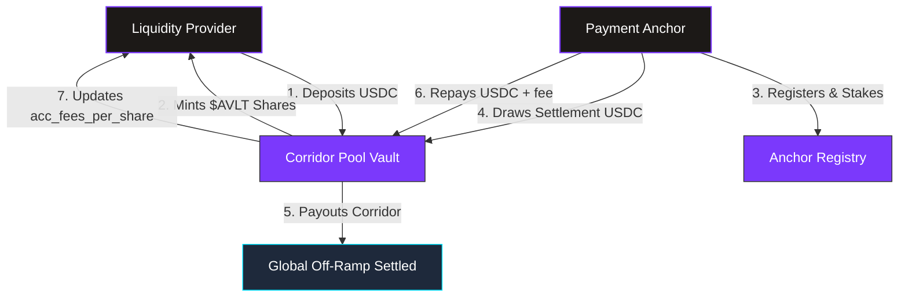
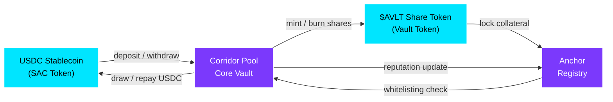
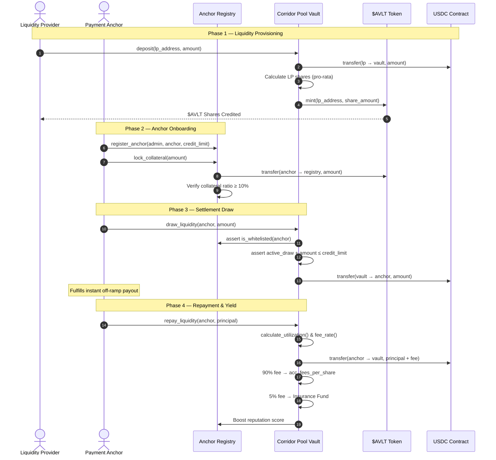
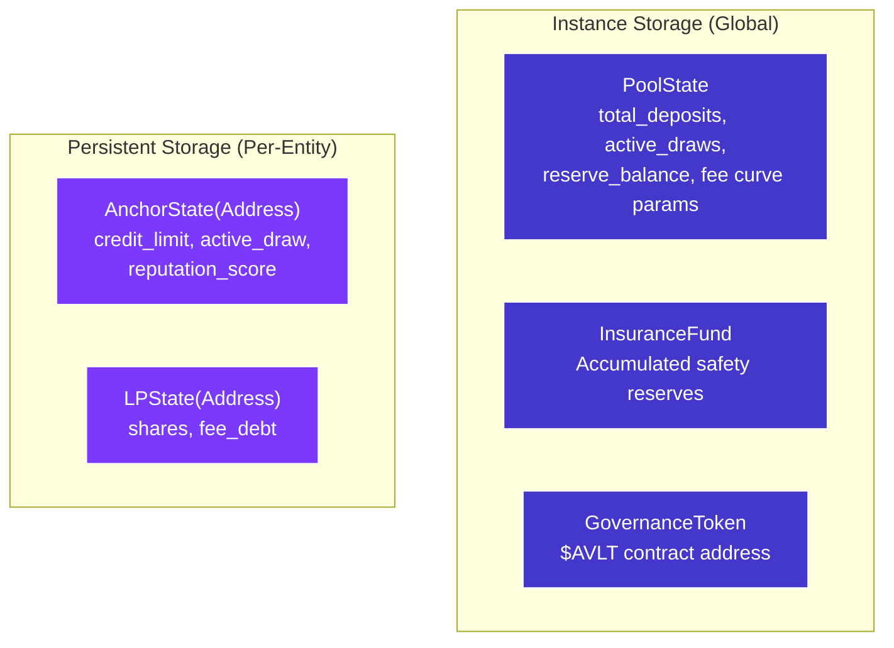

# Protocol Architecture

AnchorVault coordinates three distinct entities trustlessly on-chain: **Liquidity Providers**, **Payment Anchors**, and the **Core Smart Contracts**.

---

## High-Level Overview

---

## SCF Ecosystem Integrations

AnchorVault is submitted under the **SCF Build Integration Track**. To provide a seamless, secure, and robust experience for our users, AnchorVault deeply integrates with the following officially recommended Casper building blocks:

<CardGroup cols={2}>
  <Card title="Casper Wallets Kit" icon="wallet">
    **Primary Wallet Gateway**
    AnchorVault utilizes the [Casper Wallets Kit](https://github.com/Creit-Tech/Casper-Wallets-Kit) as our core authentication and connection layer. This allows Liquidity Providers and Anchors to securely connect using their preferred wallet ecosystem (Casper Wallet, LOBSTR, xBull) while standardizing our transaction signing payloads.
  </Card>
  <Card title="Casper Wallet Connect" icon="plug">
    **Native Casper WASM Signing**
    For our primary smart contract interactions (Deposits, Draws, Repayments), AnchorVault relies natively on [Casper Wallet API](https://docs.Casper Wallet.app/) to simulate, sign, and submit Casper WASM XDR transactions directly from the user's browser without compromising private keys.
  </Card>
</CardGroup>

---

## Smart Contract Topology

The protocol consists of **four on-chain contracts** that interact in a coordinated manner:

| Contract | Responsibility |
|:---------|:---------------|
| **USDC Stablecoin** | Core asset used in all corridor pool operations. Casper Asset Contract (SAC). |
| **Vault Share Token ($AVLT)** | ERC20-like token representing LP ownership. Minted on deposit, burned on withdrawal. |
| **Corridor Pool Vault** | Central vault managing deposits, withdrawals, draws, repayments, and yield distribution. |
| **Anchor Registry** | Manages anchor whitelisting, collateral lockups, reputation tracking, and credit limits. |

---

## Full Operational Lifecycle

---

## Data Flow Summary

<CardGroup cols={2}>
  <Card title="LP Deposit Flow" icon="arrow-down">
    1. LP sends USDC to Vault
    2. Vault calculates share ratio
    3. $AVLT minted to LP
    4. Pool reserves increase
  </Card>
  <Card title="LP Withdrawal Flow" icon="arrow-up">
    1. LP burns $AVLT shares
    2. Vault calculates USDC equivalent
    3. Pending yield auto-claimed
    4. USDC returned to LP
  </Card>
  <Card title="Anchor Draw Flow" icon="money-bill-transfer">
    1. Anchor requests USDC
    2. Vault checks whitelist + credit limit
    3. USDC transferred to anchor
    4. Pool utilization increases
  </Card>
  <Card title="Anchor Repayment Flow" icon="rotate-left">
    1. Anchor repays principal + fee
    2. Fee distributed: 90% LP / 5% Insurance / 5% Treasury
    3. Reputation score boosted
    4. Pool reserves restored
  </Card>
</CardGroup>

---

## Storage Architecture

The protocol uses Casper WASM's **instance** and **persistent** storage:

| Storage Type | Key | Data |
|:------------|:----|:-----|
| Instance | `Pool` | Global pool state — deposits, draws, reserves, fee parameters |
| Instance | `GovernanceToken` | Address of the $AVLT token contract |
| Instance | `InsuranceFund` | Accumulated insurance reserves (i128) |
| Persistent | `Anchor(Address)` | Per-anchor state — credit limit, draws, reputation |
| Persistent | `LP(Address)` | Per-LP state — shares owned, fee debt tracking |
