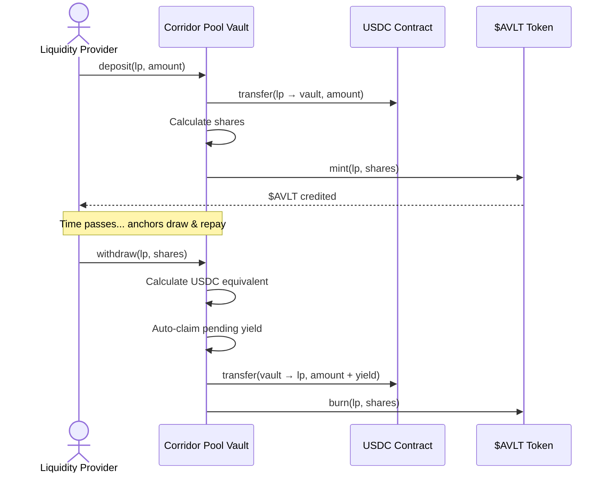

# Liquidity Providers (LPs)

Liquidity Providers are the capital backbone of AnchorVault. By depositing USDC into corridor pools, LPs earn **organic yield** generated from real cross-border settlement fees — not inflationary token emissions.

---

## LP Lifecycle



---

## Depositing USDC

When an LP deposits USDC:

1. USDC is transferred from the LP to the vault contract
2. **$AVLT share tokens** are minted proportionally
3. Any pending yield from previous shares is auto-distributed
4. The LP's `fee_debt` is reset to the current accumulator

```typescript
// Build a deposit transaction (user signs via Casper Wallet)
const xdr = await buildDepositTransaction(
  userPublicKey,
  "1000"  // 1,000 USDC
);
```

### LP State Structure

Each LP has a persistent on-chain record:

```rust
pub struct LPState {
    pub shares: i128,     // Number of $AVLT shares owned
    pub fee_debt: i128,   // Tracks already-claimed yield
}
```

---

## Yield Mechanics

LPs earn yield through the `acc_fees_per_share` accumulator. Here's how it works:

<Steps>
  <Step title="Anchor Repays Settlement">
    When an anchor repays a draw, a settlement fee is calculated based on pool utilization.
  </Step>
  <Step title="Fee Split">
    90% of the fee goes to LPs. This amount is added to `acc_fees_per_share`:
    ```
    acc_fees_per_share += (lp_fee_share × 1e12) / total_deposits
    ```
  </Step>
  <Step title="Pending Yield Calculation">
    At any time, an LP's pending yield is:
    ```
    pending = (shares × acc_fees_per_share / 1e12) - fee_debt
    ```
  </Step>
  <Step title="Auto-Distribution">
    Pending yield is automatically distributed whenever an LP deposits or withdraws. No manual claiming needed.
  </Step>
</Steps>

### Querying Pending Yield

```typescript
// Check your unclaimed yield
const pendingYield = await fetchPendingYield(userPublicKey);
console.log(`Pending yield: ${pendingYield} USDC`);
```

---

## Withdrawing

When an LP withdraws shares:

1. The corresponding USDC value is calculated from the current pool ratio
2. Pending yield is auto-claimed first
3. $AVLT shares are burned
4. USDC is transferred back to the LP

```typescript
// Build a withdrawal transaction
const xdr = await buildWithdrawTransaction(
  userPublicKey,
  "500"  // Withdraw 500 $AVLT shares
);
```

<Warning>
**Withdrawal Restrictions**: If pool utilization is very high (anchors have drawn most of the USDC), withdrawals may be restricted. LPs must wait for anchors to repay before the full withdrawal can execute.
</Warning>

---

## Risk Considerations

| Risk | Mitigation |
|:-----|:-----------|
| **Anchor Default** | Insurance Fund absorbs bad debt. Anchor collateral is slashed. |
| **High Utilization Lock** | Aggressive fee curve incentivizes rapid anchor repayment. |
| **Smart Contract Risk** | Contracts audited and deployed on Casper's secure Casper WASM VM. |
| **Impermanent Loss** | N/A — corridor pools are single-asset (USDC only). No IL risk. |

<Tip>
Unlike AMM-based DeFi pools, AnchorVault corridor pools are **single-asset USDC pools**. There is zero impermanent loss risk since LPs deposit and withdraw the same stablecoin.
</Tip>
