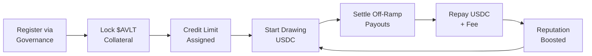

# Payment Anchors

Payment Anchors are licensed off-ramp operators who draw USDC from corridor pools to fulfill instant remittance payouts. They are the bridge between AnchorVault's on-chain liquidity and real-world fiat settlement.

---

## Anchor Onboarding Flow



---

## Registration

Anchors are whitelisted by the protocol admin (governance) in both the **Anchor Registry** and the **Corridor Pool Vault**:

```typescript
// Admin registers an anchor (dual-registration)
await registerAnchorOnChain(
  anchorPublicKey,
  "150000"  // $150,000 USDC credit limit
);
```

This performs two on-chain operations:
1. `AnchorRegistry.register_anchor()` — Whitelists the anchor with initial 80% reputation
2. `CoreVault.register_anchor()` — Enables the anchor to draw from the pool

### Anchor Record (Registry)

```rust
pub struct AnchorRecord {
    pub is_whitelisted: bool,      // Active status
    pub credit_limit: i128,        // Maximum drawable USDC
    pub reputation_score: u32,     // 0-1000 (80% default)
    pub locked_collateral: i128,   // $AVLT tokens locked
    pub first_registered: u64,     // Registration timestamp
}
```

### Anchor State (Vault)

```rust
pub struct AnchorState {
    pub is_registered: bool,       // Active in vault
    pub credit_limit: i128,        // Max draw allowed
    pub active_draw: i128,         // Currently outstanding USDC
    pub reputation_score: u32,     // Synced reputation
    pub last_draw_timestamp: u64,  // Last draw time
}
```

---

## Collateral Requirements

Anchors must lock **$AVLT governance tokens** as collateral to back their credit capacity:

$$\text{Min Collateral} = \frac{\text{credit\_limit} \times \text{min\_collateral\_ratio\_bps}}{10000}$$

With the default **10% (1000 bps)** ratio:
- **$150,000 credit limit** → Must lock **$15,000** worth of $AVLT

```typescript
// Lock collateral (user signs via Casper Wallet)
const xdr = await buildLockCollateralTransaction(
  anchorPublicKey,
  "15000"  // Lock 15,000 $AVLT
);
```

<Info>
Collateral can be released back to the anchor only if the remaining collateral still satisfies the minimum ratio. The `release_collateral` function enforces this check.
</Info>

---

## Drawing Liquidity

Once whitelisted and collateralized, anchors can draw USDC:

```typescript
const xdr = await buildDrawLiquidityTransaction(
  anchorPublicKey,
  "50000"  // Draw 50,000 USDC
);
```

The vault enforces three checks before approving a draw:

<Steps>
  <Step title="Whitelist Check">
    The anchor must be registered and `is_registered == true`.
  </Step>
  <Step title="Credit Limit Check">
    `active_draw + amount` must not exceed the anchor's `credit_limit`.
  </Step>
  <Step title="Liquidity Check">
    The draw amount must not exceed the pool's `reserve_balance`.
  </Step>
</Steps>

---

## Repaying Liquidity

After settling the off-ramp payout, anchors repay the principal plus a dynamic fee:

```typescript
const xdr = await buildRepayLiquidityTransaction(
  anchorPublicKey,
  "50000"  // Repay 50,000 USDC principal
);
```

The settlement fee is calculated automatically based on:
1. **Pool utilization** at the time of repayment
2. **Anchor's reputation score** (discount/premium modifier)

### Fee Modifiers

| Reputation Score | Modifier | Effect |
|:----------------|:---------|:-------|
| > 900 (Excellent) | Up to 25% discount | `fee × (100 - (score-900)/4) / 100` |
| 600–900 (Standard) | No modifier | Standard fee rate |
| < 600 (Poor) | Up to 50% premium | `fee × (100 + (600-score)/8) / 100` |

---

## Registered Anchors

AnchorVault currently has four registered payment anchors covering global corridors:

| Anchor | Corridor | Credit Limit |
|:-------|:---------|:-------------|
| 🇪🇺 **Anchora** | Euro Corridor (EUR) | $150,000 |
| 🇧🇷 **DeltaPay** | Latam Corridor (BRL) | $120,000 |
| 🇸🇬 **ApexRemit** | APAC Corridor (SGD) | $140,000 |
| 🇳🇬 **SkyRemit** | Africa Corridor (NGN) | $90,000 |

<Tip>
Any Casper address can be registered as an anchor by the protocol admin. The `register_anchor` function supports upsert logic — re-registering an existing anchor updates its credit limit without losing existing state.
</Tip>
