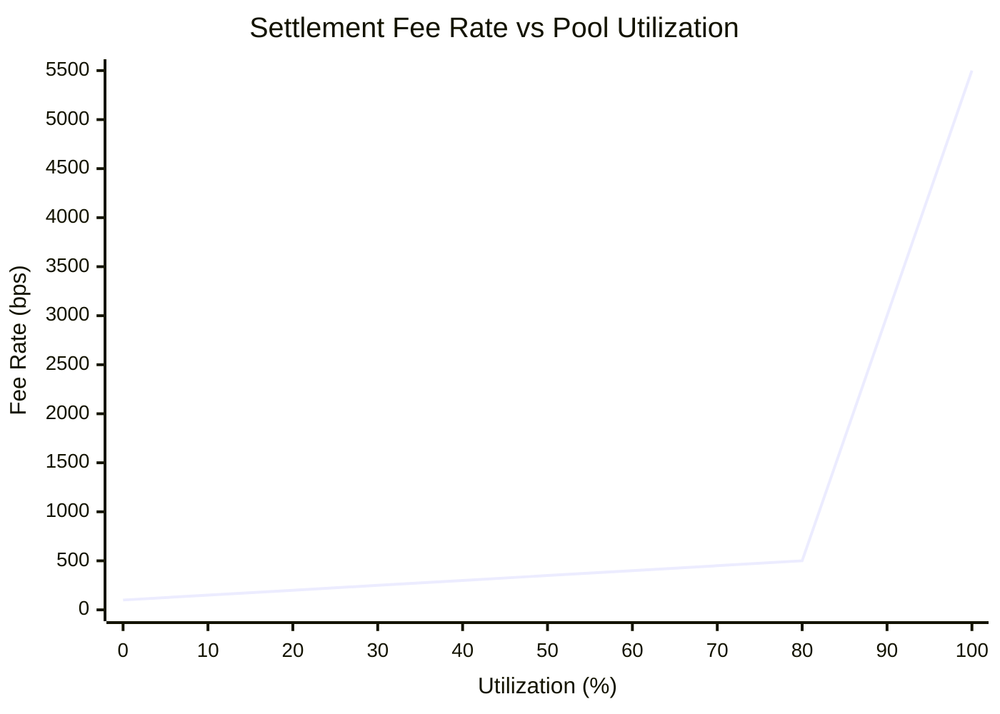
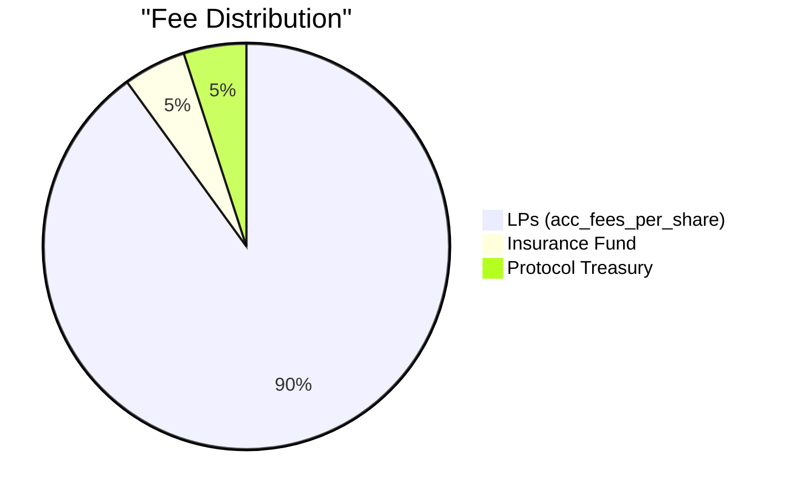

# Dynamic Interest & Fee Model

AnchorVault manages LP risk and incentivizes timely anchor repayments using a **Two-Slope Utilization Curve** — a proven DeFi mechanism inspired by Aave and Compound's interest rate models.

---

## Pool Utilization

Pool utilization $U$ is the ratio of active anchor draws to total pool capital:

$$U = \frac{\text{active\_draws}}{\text{reserve\_balance} + \text{active\_draws}}$$

Expressed in **basis points (bps)** where 10000 bps = 100%.

```rust
fn calculate_utilization(pool: &PoolState) -> u32 {
    let total_capital = pool.reserve_balance + pool.active_draws;
    if total_capital == 0 { return 0; }
    ((pool.active_draws * 10000) / total_capital) as u32
}
```

---

## Two-Slope Fee Curve

The fee rate $R$ (in basis points) changes dynamically based on whether utilization exceeds the **optimal threshold** $U_{\text{optimal}}$:

### Normal Range ($U \le U_{\text{optimal}}$)

Interest fees scale moderately to keep borrowing costs low and encourage anchor activity:

$$R = R_{\text{base}} + \left(\frac{U}{U_{\text{optimal}}}\right) \times R_{\text{slope1}}$$

### Penalty Range ($U > U_{\text{optimal}}$)

Interest fees scale **aggressively** to discourage further draws and force anchors to repay, restoring liquidity for LPs:

$$R = R_{\text{base}} + R_{\text{slope1}} + \left(\frac{U - U_{\text{optimal}}}{10000 - U_{\text{optimal}}}\right) \times R_{\text{slope2}}$$

---

## Deployed Parameters

| Parameter | Symbol | Value | Description |
|:----------|:-------|:------|:------------|
| Optimal Utilization | $U_{\text{optimal}}$ | **80.00%** (8000 bps) | Equilibrium target |
| Base Fee | $R_{\text{base}}$ | **1.00%** (100 bps) | Floor fee at 0% utilization |
| Slope 1 | $R_{\text{slope1}}$ | **4.00%** (400 bps) | Linear growth below optimal |
| Slope 2 | $R_{\text{slope2}}$ | **50.00%** (5000 bps) | Aggressive growth above optimal |

---

## Fee Curve Visualization



| Utilization | Fee Rate | Description |
|:------------|:---------|:------------|
| 0% | 1.00% (100 bps) | Base fee only |
| 40% | 3.00% (300 bps) | Half-slope moderate growth |
| 80% | 5.00% (500 bps) | At optimal — manageable fees |
| 90% | 30.00% (3000 bps) | Penalty zone — steep increase |
| 100% | 55.00% (5500 bps) | Maximum penalty — forces repayment |

<Warning>
The steep penalty curve above 80% utilization is intentional. It creates strong economic incentives for anchors to repay quickly when pool liquidity is stressed, protecting LP capital.
</Warning>

---

## Reputation-Based Modifiers

After the base fee rate is calculated from utilization, the anchor's **reputation score** applies a discount or premium:

### High Reputation (Score > 900)
Trusted anchors receive a **fee discount** of up to 25%:
$$R_{\text{final}} = R \times \frac{100 - \frac{\text{score} - 900}{4}}{100}$$

### Low Reputation (Score < 600)
Risky anchors pay a **fee premium** of up to 50%:
$$R_{\text{final}} = R \times \frac{100 + \frac{600 - \text{score}}{8}}{100}$$

### Example

| Scenario | Utilization | Base Fee | Reputation | Final Fee |
|:---------|:------------|:---------|:-----------|:----------|
| Standard | 50% | 3.5% | 800 | 3.50% |
| Trusted | 50% | 3.5% | 950 | 3.06% (-12.5%) |
| Risky | 50% | 3.5% | 400 | 4.38% (+25%) |

---

## Fee Distribution Breakdown

When an anchor repays `principal + fee`:



```rust
let lp_fee_share = (fee * 90) / 100;
let insurance_share = (fee * 5) / 100;
// Remaining 5% to treasury (protocol operations)
```

<Tip>
The 90/5/5 split ensures LPs receive the lion's share of yield while maintaining protocol safety through the Insurance Fund and operational sustainability via the Treasury.
</Tip>
