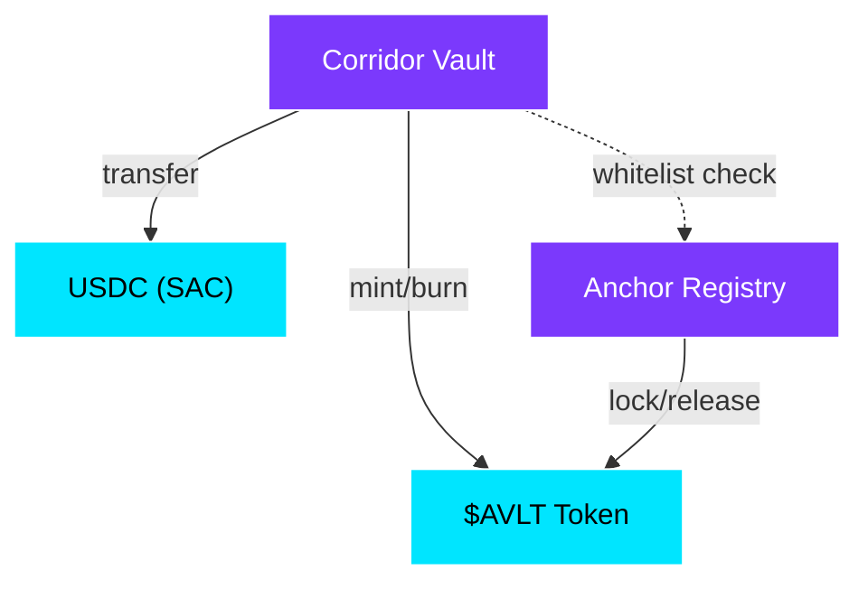

# Smart Contract Overview

AnchorVault's protocol logic lives in **three Rust smart contracts** compiled to WASM and deployed on Casper's Casper WASM VM.

## Contract Suite

<CardGroup cols={3}>
  <Card title="Corridor Pool Vault" icon="vault" href="/contracts/corridor-vault">
    Core vault managing deposits, withdrawals, liquidity draws, repayments, and yield distribution.
  </Card>
  <Card title="Anchor Registry" icon="list-check" href="/contracts/anchor-registry">
    Manages anchor whitelisting, collateral lockups, reputation scoring, and credit limits.
  </Card>
  <Card title="Vault Token ($AVLT)" icon="coins" href="/contracts/vault-token">
    ERC20-like share token representing LP ownership. Minted on deposit, burned on withdrawal.
  </Card>
</CardGroup>

## Technology Stack

| Component | Technology |
|:----------|:-----------|
| Language | Rust (`#![no_std]`) |
| Platform | Casper Casper WASM |
| Compilation Target | `wasm32-unknown-unknown` |
| SDK | `Casper WASM-sdk` |
| Token Standard | Casper WASM Token Interface |
| Precision | 7 decimals (Casper standard) |

## Contract Interactions

## Deployed Addresses (Testnet)

| Contract | Address |
|:---------|:--------|
| USDC | `CCW67CUUZD4BY...` |
| $AVLT Token | `CCG35K57NAFGZ3...` |
| Anchor Registry | `CAWO6A52CISR4J...` |
| Corridor Vault | `CCU3RFCKEG2OIQ...` |
