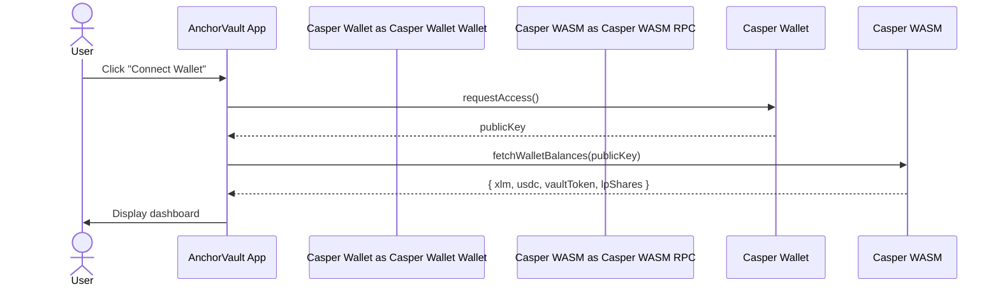

# Wallet Integration

AnchorVault uses the **Casper Wallet** browser extension for Casper wallet connectivity and transaction signing.

## Dependencies

```json
{
  "@creit.tech/Casper-wallets-kit": "^2.2.0",
  "@Casper/Casper Wallet-api": "^6.0.1"
}
```

## Connection Flow



## Transaction Signing Flow

```typescript
// 1. Build the unsigned transaction
const xdr = await buildDepositTransaction(userPubKey, "1000");

// 2. Request user signature via Casper Wallet
const signedXdr = await Casper Wallet.signTransaction(xdr, {
  networkPassphrase: "Test SDF Network ; September 2015",
});

// 3. Submit the signed transaction
const result = await submitTransaction(signedXdr);

// 4. Handle result
if (result.status === "SUCCESS") {
  console.log(`TX confirmed! Hash: ${result.hash}`);
  console.log(`Ledger: ${result.ledger}`);
}
```

## Explorer Links

```typescript
import {
  getCasperExpertTxUrl,
  getCasperExpertAccountUrl,
  getCasperExpertContractUrl,
} from './lib/Casper WASM';

// Transaction: https://Casper.expert/explorer/testnet/tx/{hash}
const txUrl = getCasperExpertTxUrl(txHash);

// Account: https://Casper.expert/explorer/testnet/account/{address}
const accountUrl = getCasperExpertAccountUrl(publicKey);

// Contract: https://Casper.expert/explorer/testnet/contract/{id}
const contractUrl = getCasperExpertContractUrl(contractId);
```

## Testnet Funding

```typescript
import { fundWithFriendbot } from './lib/Casper WASM';

// Fund a testnet account with 10,000 XLM
const success = await fundWithFriendbot(publicKey);
```

<Tip>
The app includes a built-in **USDC Faucet** that mints mock testnet USDC directly to the connected wallet via the deployer's admin authority.
</Tip>
